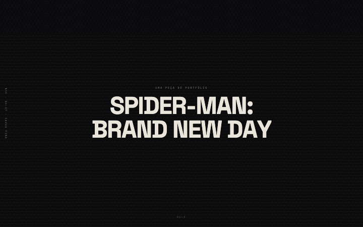

# Spider-Man: Brand New Day — uma landing 3D cinematográfica

[](https://github.com/Claytonrss/brand-new-day/actions/workflows/ci.yml)
[](LICENSE)
[](https://creativecommons.org/licenses/by/4.0/)

**→ [Demo ao vivo](https://brand-new-day-fan.vercel.app/)** — uma landing 3D scroll-driven onde a direção de arte é a feature principal e cada afirmação deste README é auditável. Portfólio de **Clayton Rafael**. A peça: uma noite chuvosa em Nova York, atravessada em um único movimento contínuo de câmera.



## O que este projeto prova

Portfólio precisa provar, não afirmar. Quatro competências, cada uma com a prova ao lado:

**1. Rendering 3D em tempo real sob orçamento de frame.** Qualidade adaptativa em três tiers com resolução síncrona do tier inicial (o mobile nunca começa no perfil desktop), 44–46 draw calls no tier alto e um orçamento automatizado que bloqueia o projeto acima de 48. → veja ao vivo com o HUD de [`?debug`](https://brand-new-day-fan.vercel.app/?debug).

**2. Craft medido, não afirmado.** Lighthouse **58–67 mobile / 93–97 desktop** no deploy ao vivo (três execuções por perfil), 168 testes unitários + 14 specs visuais, todos verdes, A11y/Best Practices/SEO 100. → re-meda tudo você mesmo (um comando, abaixo).

**3. Direção de arte com execução de engenharia.** Um rig procedural de 16 joints anima um asset que vem sem uma única animação embutida; uma câmera contínua de 7 beats carrega a narrativa; uma design doc vinculante define o enquadramento e o ritmo de cada seção. → a profundidade está em "A engenharia por trás", abaixo.

**4. IA como ferramenta de engenharia, com governança.** Um harness delegation-only de 10 agentes, com allowlists de comandos por agente e 34 ADRs documentando cada decisão. → detalhes em "O harness de IA", abaixo.

## A engenharia por trás

O mecanismo de cada afirmação acima:

**1. Rig procedural em vez de clipes de animação.** O GLB contém zero animações — verificado no header do asset (`animations: 0`, 66 joints no esqueleto). O personagem ganha vida em código: vida idle (respiração, sway, transferência de peso, micro-tremor), poses por beat, aterrissagem por molas, lean por velocidade, head tracking limitado a limites autorais e um halo de spider-sense ancorado no osso do crânio. Até a piscada é sintética — o asset não tem pálpebras, então é um "obturador" no shader sobre as lentes, uma simplificação aceita conscientemente ([tech-debt, TD-001](docs/memory/tech-debt.md)). Os testes unitários cobrem a matemática — overshoot das molas, limites de rotação da cabeça, timing dos beats — não apenas "renderizou sem erro".

**2. Uma câmera contínua.** Uma spline Catmull-Rom (posição, look-at e FOV, por breakpoint) carrega a câmera pelos 7 beats narrativos, sincronizada ao scroll via GSAP ScrollTrigger + Lenis. O pico de mudança de direção por frame é de 62,1°, com p95 de 20,2° (medição registrada no [ADR-011](docs/memory/decisions.md)); o pico residual é staging intencional — o recuo do close-up até o punho —, não erro de curva.

**3. Qualidade adaptativa em três tiers.** O primeiro frame pintado já carrega o custo real do dispositivo, então o tier é resolvido de forma síncrona (`src/components/3d/perf/initialTier.ts`). A degradação é idle-gated com histerese: os tiers só mudam com o scroll parado, e voltar para cima exige um limiar de FPS mais alto do que cair (`PerformanceMonitor.tsx`). No tier médio, o passe de sombra atualiza a 10 Hz em vez de a cada frame, com refresh imediato em mudança real de pose — um vale medido de ~16 draw calls entre refreshes (46 com o passe vs. 30 sem, ADR-023). Escada de DPR 1,75 / 1,25 / 1,00, MSAA 4× / 0 / 0, e depth-of-field + aberração cromática reservados ao tier alto.

## O harness de IA

O projeto foi construído sob um orquestrador delegation-only: um agente que lê o estado do repo e delega — nunca executa por si só —, cercado por 10 agentes especializados definidos no [`opencode.json`](opencode.json): exploração, planejamento, dois implementadores (frontend e geral), escrita de testes, verificação, auditoria de segurança, operações git e documentação.

A parte interessante não são os agentes — são as restrições:

- **O orquestrador não edita arquivos nem escreve no git.** `edit: deny` e bash reduzido a leitura — `git commit`, `git push` e `git add` negados para ele.
- **Dependência é decisão humana.** `pnpm install` e `pnpm add` são negados nos implementadores.
- **Operações destrutivas negadas por padrão.** `rm -rf`, `git push --force` e `git reset --hard` bloqueados em todos os workers.
- **Evidência ou não aconteceu.** Lint, typecheck, testes unitários, build e specs visuais rodam como gates; cada entrega carrega seus logs, a rubrica visual e os três viewports.

34 ADRs em [`docs/memory/decisions.md`](docs/memory/decisions.md) registram cada decisão de arquitetura. O resultado é IA como mão de obra governada — não como fonte de verdade. O desenho completo do sistema: [case study](docs/case-study-ai-harness.md).

## Stack

| Camada        | Ferramentas                                                        | O que fazem aqui                                                                                |
| ------------- | ------------------------------------------------------------------ | ----------------------------------------------------------------------------------------------- |
| UI            | React 19 · TypeScript 5.9 · Tailwind CSS v4                        | Overlays tipográficos sobre o canvas, com design tokens próprios                                |
| 3D            | three.js · @react-three/fiber · drei · @react-three/postprocessing | Canvas declarativo, loader KTX2, Bloom/depth-of-field/aberração cromática no tier alto          |
| Motion        | GSAP ScrollTrigger · Lenis                                         | Câmera e overlays sincronizados ao scroll                                                       |
| Assets        | glTF + meshopt · KTX2 (Basis)                                      | GLB de 6,5 MB com quantização de vértices; texturas transcodificadas para formatos de GPU       |
| Qualidade     | Vitest · Playwright · ESLint · Prettier · Husky + commitlint       | 168 testes unitários, 14 specs visuais e os gates automatizados                                 |
| Build & infra | Vite 8 · Vercel                                                    | Build TypeScript + Vite; edge function recebe o beacon de falha de WebGL; analytics sem cookies |

## Performance, medida

Cada número abaixo foi medido em **2026-09-15** contra o deploy ao vivo ou um build de produção fresco deste exato código — nada carregado de docs internos antigos, nada que você não possa re-medir com um comando. Lighthouse 13.4.1; os scores mobile usam o throttling simulado do Lighthouse, três execuções reportadas como faixa.

| Métrica                                          | Valor (2026-09-15)                                                                                                        |
| ------------------------------------------------ | ------------------------------------------------------------------------------------------------------------------------- |
| Lighthouse Performance                           | **mobile 58–67** (3 execuções, mediana 66) · **desktop 93–97** (3 execuções, mediana 97)                                  |
| Lighthouse Acessibilidade / Best Practices / SEO | 100 / 100 / 100 nos dois perfis                                                                                           |
| Total Blocking Time (mobile, simulado)           | 800–850 ms                                                                                                                |
| Bundle JS                                        | entry 270 kB (86 kB gzip) · vendor-3d 1.175 kB (327 kB gzip, cacheável entre visitas) · vendor-motion 132 kB (49 kB gzip) |
| Modelo 3D                                        | GLB de 6,5 MB — meshopt + quantização de vértices (ADR-029)                                                               |
| Draw calls                                       | 44–46 no tier alto (ADR-011) · gate automatizado valida ≤ 48 (headless)                                                   |
| Testes                                           | 168 unitários (Vitest) + 14 specs visuais (Playwright), todos verdes                                                      |

**A leitura honesta.** O score mobile é limitado pelo formato: a rede lenta simulada do Lighthouse precisa baixar o modelo de 6,5 MB, e esse download domina a simulação — o loader cinematográfico mostra progresso real durante ela. O TBT de ~0,8 s diz que a main thread está saudável.

O que os números do Lighthouse **não** dizem: **não existe validação de FPS em device real** ([TD-002](docs/memory/tech-debt.md)). Todos os números de FPS automatizados deste repo vêm de renderizador headless (SwiftShader) e ficam de fora dos gates de propósito — os proxies fiscalizados são draw calls, programs e triângulos. Em um device real, o HUD `?debug` mostra o que os proxies não cobrem.

Quer os recibos? [`?debug`](https://brand-new-day-fan.vercel.app/?debug) no site ao vivo expõe o HUD de performance (`window.__perf`: fps, ms/frame, draw calls, triângulos, programs). Lint, typecheck, testes unitários, build de produção e specs visuais do Playwright rodam como gates automatizados do projeto.

## Como rodar localmente

```bash
git clone https://github.com/Claytonrss/brand-new-day.git
cd brand-new-day
pnpm install
pnpm dev
```

Requer Node ≥ 22 e pnpm 9. `pnpm verify` roda todos os gates de qualidade (lint + typecheck + unit + build); `pnpm test:smoke` roda a suíte smoke do Playwright; `pnpm inspect:glb` imprime os metadados do asset; adicione `?debug` à URL para o HUD de performance.

Privacidade: Vercel Analytics + Speed Insights (sem cookies, same-origin — sem banner) e um beacon anônimo de `webgl_unavailable` (evento + user-agent, sem PII), para que falhas silenciosas de rendering virem sinal. Nenhuma requisição externa no load: fontes e o ambiente HDR são self-hosted, e a CSP só permite conexões same-origin e blob.

## Credits & license

- **Code:** MIT — [LICENSE](LICENSE)
- **3D model:** "Spider-Man Brand New Day" by Eskze ([Sketchfab](https://sketchfab.com/3d-models/spider-man-brand-new-day-ff9df30377094808ba9df7c82cb09cda)), [CC BY 4.0](https://creativecommons.org/licenses/by/4.0/) — converted and optimized (KTX2 + meshopt, ADR-029). Attribution is rendered inside the app in every section that shows the model, visible without hover, as the license requires — a Playwright spec fails if it disappears.
- **Fonts:** Space Grotesk & JetBrains Mono, SIL OFL 1.1 ([OFL.txt](public/fonts/OFL.txt))
- **Disclaimer:** unofficial, non-commercial fan project — not affiliated with or endorsed by Marvel, Sony or Disney. Full third-party list: [NOTICE.md](NOTICE.md)

## In English

A scroll-driven 3D landing page built as a portfolio proof, not a demo: cinematic art direction (one continuous camera through seven narrative beats) executed under real engineering constraints — a 16-joint procedural rig on a model with zero baked animations, adaptive three-tier WebGL quality (44–46 draw calls on high, an automated budget gate holds the line at 48), and an AI agent harness with per-agent command allowlists (10 agents, 34 ADRs). Built with React 19, TypeScript, three.js/react-three-fiber, GSAP ScrollTrigger, Tailwind CSS v4 and Vite. State measured on 2026-09-15 against the live deploy: Lighthouse **58–67 mobile / 93–97 desktop** (3 runs each), A11y/Best Practices/SEO 100, TBT ~0.8 s, 6.5 MB meshopt GLB, 168 unit tests + 14 visual specs, all green. Known limitation: no real-device FPS validation ([TD-002](docs/memory/tech-debt.md)). Audit everything yourself: [`?debug`](https://brand-new-day-fan.vercel.app/?debug) exposes the live perf HUD; `pnpm install && pnpm dev` runs it locally (Node ≥ 22, pnpm 9). MIT-licensed code; the model is "Spider-Man Brand New Day" by Eskze, [CC BY 4.0](https://creativecommons.org/licenses/by/4.0/). Unofficial fan project, not affiliated with Marvel/Sony/Disney.

---

## Feito por: Clayton Rafael

Este projeto é meu portfólio — se a peça disse algo para você, seja para conversar sobre ela ou sobre o que podemos construir juntos:

**→ [Me chame no LinkedIn](https://www.linkedin.com/in/clayton-rafael/)** · [GitHub](https://github.com/Claytonrss)
